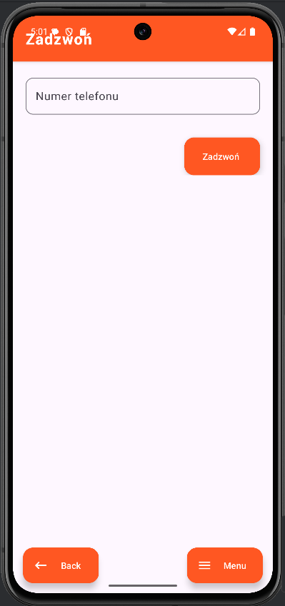

# 📱 Simple Communication App (SMS, MMS, Call, Email)

## About
This is a mobile Android application built using **Android Studio + Java**.
It provides basic communication functionalities such as sending **SMS, MMS**, making **calls**, and sending **emails**.
The app is designed with **Material 3** components for a modern and smooth interface, and is fully functional on Android devices with SDK 28 and above.

---

## Features

### Main Features
- **Call Activity**
  - Input for phone number
  - Button to initiate a call (with runtime permission request)
  - Validation ensures a phone number is entered
  - Back button to return to the main activity
  

- **Email Activity**
  - Input for recipient email, subject, and message
  - Subject defaults to "Subject" if left empty
  - Opens chosen email client with pre-filled data
  - Validation ensures email and message are provided

- **MMS Activity**
  - Input for phone number
  - Button to select an image from gallery
  - Button to send MMS via chosen communication app
  - Validation ensures phone number is not empty

- **SMS Activity**
  - Input for phone number and message
  - Options to:
    1. Send SMS directly
    2. Use SMS intent to open SMS app
    3. Send multipart SMS (splits long messages)
  - Displays sent messages in a RecyclerView
  - Captured messages are saved to a `messages.txt` file
  - Button to clear message file
  - Validation ensures phone number and message are not empty

---

## Architecture & Key Classes

- **BaseActivity**
  - Handles menu, dynamic shortcuts, and permission requests
  - Base class for all activities

- **MessageAdapter**
  - Custom RecyclerView adapter displaying sent messages
  - Uses `message_item.xml` layout
  - Updates RecyclerView dynamically

- **MessageModel**
  - Model representing a single message (`phoneNumber` + `message`)
  - Helper for the adapter

- **SmsReceiver**
  - Captures sent SMS messages from SMSActivity
  - Uses `FileManager` to save messages to `messages.txt`

- **FileManager**
  - Writes phone numbers and messages to a TXT file line by line
  - Format: `phoneNumber | message`

---

## Shortcuts & Menu

- **Dynamic Shortcuts**
  - Created and managed in `BaseActivity`

- **Static Shortcuts**
  - Defined in `shortcuts.xml` and declared in the manifest

- **Material 3 FAB Menu**
  - Animated, smooth, and included in each activity layout (`fab_menu.xml`)

---

## Screenshots
*(Add screenshots of each activity here)*

---

## Installation & Usage

1. Clone this repository:
   ```bash
   git clone <repository-url>
   ```
2. Open in **Android Studio**
3. Build and run on an emulator or physical device with **SDK 28+**
4. Grant necessary permissions when prompted
5. Enjoy sending SMS, MMS, calls, and emails!

---

## Libraries & Tools
- **Android Studio**
- **Java**
- **Material 3**: `1.13.0`
- **Android Gradle Plugin**: `8.10.1`
- **JUnit**: `4.13.2`
- **Espresso Core**: `3.7.0`
- **AppCompat**: `1.7.1`
- **Activity**: `1.11.0`
- **ConstraintLayout**: `2.2.1`

---

## Android SDK Versions
- **Compile SDK**: 36  
- **Min SDK**: 28  
- **Target SDK**: 35

---

## License
**Free to use** – you can use, modify, and distribute this project without restrictions.
